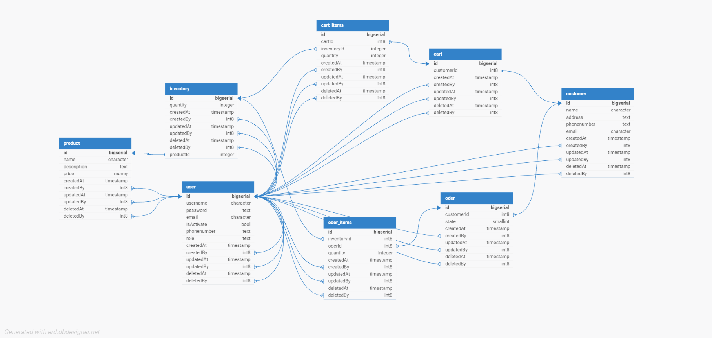

## Tổng quan chung

Bài tập xây dựng backend với Nestjs.

## Các chức năng chính

#### User

Chức năng đăng ký: người dùng đăng ký tài khoản với hệ thống.

Chức năng xem thông người dùng: người dùng với role owner có thể danh sách thông tin cơ bản của user.

#### Auth

Chức năng đăng nhập: người dùng đăng nhập vào hệ thống với tài khoản đã được đăng ký. Nếu đăng nhập thành công thì trả về token dùng để xác thực người dùng trong hệ thống.

Chức năng xem thông tài khoản: xem thông tin tài khoản đang được đăng nhập trong hệ thống.

#### Product

Quản lý sản phẩm.

Chức năng tạo sản phẩm: thêm mới thông tin về sản phẩm.

Chức năng xem sản phẩm: gồm xem toàn bộ danh sách sản phẩm và xem chi tiết một sản phẩm.

Chức năng cập nhật sản phẩm: chỉnh sửa thông tin của một sản phẩm.

Chức năng xoá - khôi phục: có thể xoá một sản phẩm và khôi phục sản phẩm đã xoá. 

### Inventory

Quản lý kho hàng.

Chức năng thêm sản phẩm: thêm số lượng sản phẩm vào kho hàng.

Chức năng xem kho hàng: gồm xem danh sách các sản phẩm và xem chi tiết về sản và số lượng có trong kho hàng.

Cập nhập sản phẩm trong kho hàng: số lượng sản phẩm trong kho hàng được cập nhật.

Chức năng xoá - khôi phục: có thể loại bỏ một sản phẩm và khôi phục sản phẩm trong kho hàng.

#### Customer

Quản lý thông tin khách hàng.

Chức năng thêm khách hàng: thêm mới thông tin khách hàng.

Chức năng xem thông tin khách hàng: xem danh sách thông tin khác hàng và xem chi tiết thông tin của một khách hàng.

Chức năng cập nhật khách hàng: cập nhật thông tin về khách hàng.

Chức năng xoá - khôi phục khách hàng: có thể xoá và khôi phục lại thông tin khách hàng đã xoá.

#### Cart

Quản lý các sản phẩm trong giỏ hàng.

Chức năng tạo giỏ hàng: mỗi khách hàng sẽ tương ứng với một giỏ hàng.

Chức năng thêm sản phẩm: thêm một sản phẩm với vào giỏ hàng, nếu đã có thì tăng số lượng.

Chức năng xem giỏ hàng: xem danh sách các giỏ hàng hoặc xem chi tiết từng giỏ hàng

Chức năng cập nhật sản phẩm trong giỏ hàng: cập nhật thay đổi số lượng của sản phẩm trong giỏ hàng.

Chức năng xoá - khôi phục sản phẩm trong giỏ hàng: có thể xoá và khôi phục lại sản phẩm trong giỏ hàng.

#### Order

Quản lý các đơn hàng.

Chức năng tạo đơn hàng: thực hiện lên đơn hàng từ giỏ hàng.

Chức năng xem đơn hàng: xem danh sách các đơn hàng hoặc chi tiết một đơn hàng.

Chức năng cập nhật đơn hàng: cập nhật trạng thái của đơn hàng.

## Database schema



## Setup và run locally

#### Cấu trúc file .env

```env
PORT=

DATABASE_TYPE=
DATABASE_HOST=
DATABASE_PORT=
DATABASE_USERNAME=
DATABASE_PASSWORD=
DATABASE_NAME=

SECRET=
```

#### Project setup

```bash
$ npm install
```

#### Run migrations

```bash
# generate migration
$ npm run migration:generate -- src/db/migrations/name_of_migration

# applay migrations
$ npm run migration:run

# revert lastest migration apply
$ npm run migration:revert
```

#### Compile and run the project

```bash
# development
$ npm run start

# watch mode
$ npm run start:dev

# production mode
$ npm run start:prod
```

#### Run tests

```bash
# unit tests
$ npm run test

# e2e tests
$ npm run test:e2e

# test coverage
$ npm run test:cov
```

## Nestjs Developmenet Resources

Check out a few resources that may come in handy when working with NestJS:

- Visit the [NestJS Documentation](https://docs.nestjs.com) to learn more about the framework.
- For questions and support, please visit [Discord channel](https://discord.gg/G7Qnnhy).
- To dive deeper and get more hands-on experience, check out our official video [courses](https://courses.nestjs.com/).
- Visualize your application graph and interact with the NestJS application in real-time using [NestJS Devtools](https://devtools.nestjs.com).
- Need help with project (part-time to full-time)? Check out our official [enterprise support](https://enterprise.nestjs.com).
- To stay in the loop and get updates, follow on [X](https://x.com/nestframework) and [LinkedIn](https://linkedin.com/company/nestjs).
- Looking for a job, or have a job to offer? Check out official [Jobs board](https://jobs.nestjs.com).